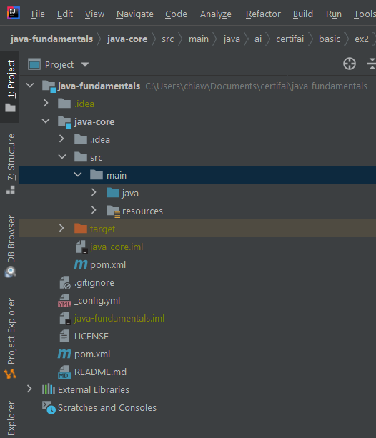
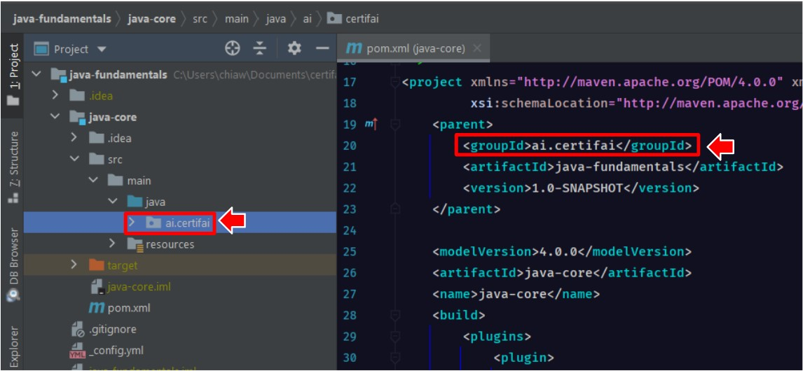

# QuickStart!

**What To Do**  
Pass `new PackagingIntro().getClass().getCanonicalName()` to the variable [_packageName_](https://github.com/CertifaiAI/learn-java-the-certifai-way/blob/master/java-core/src/main/java/ai/certifai/basic/ex2/PackagingIntro.java#L38)
 

**Sample Output**  
`
Package Name = ai.certifai.basic.ex2.PackagingIntro 
`  

**Key Takeaways**  
- Basic file directory structure of java project by Apache Maven

  

 

- A few key components to take note of 

  

 

- **Group ID**: Reverse domain name of an organization.  
- Group ID contribute to the beginning of packages name

  

 

- **Packages** group related classes, interfaces, and sub-packages.  
- Packages are defined all in lower case.  
- Packages are period-delimited.    
- Essentially, packages are used to prevent conflicts with file names.  

  

 

**Quiz**  

1. What does the keyword **_public_** means?
 The keyword public is an **_access modifier_**. It can be assigned to variables, methods, constructors,
and classes. With public access modifier, it implies that the object is made accessible everywhere.

2. What does the word **_static_** means?
 There are two different types of variables(data) within a class: instance and static.
 For static variables, the variables are allocated to a separate area of memory and exist for the lifetime
of the class.